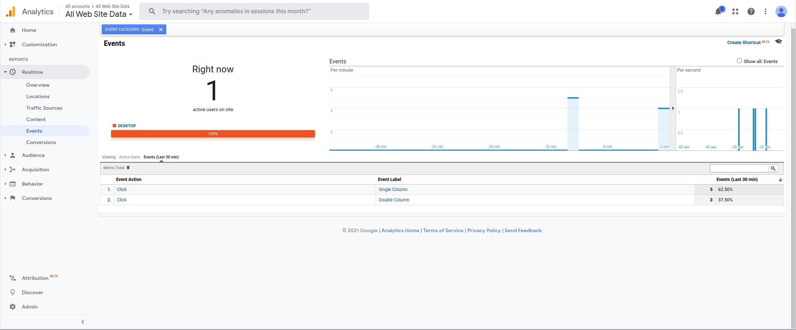

# Lab 10

## Part 1:

### Link to canny.io
https://cse110-lab10-r2zheng.canny.io/

## Part 2:

### Link to index.html
https://r2zheng.github.io/Lab10/

### Link to secondSplit.html
https://r2zheng.github.io/Lab10/secondSplit.html

### Explanation of Part 2 A/B Test secondSplit
1. on: blue background
2. off: keep yellow background

## Part 3:

### Part 3 Screenshots

See analytics_screenshot.png

